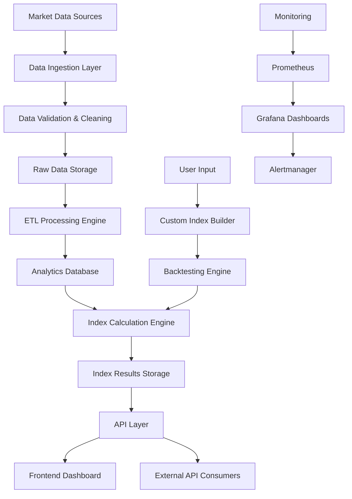

# Index Platform - Architecture Summary
## Solactive-Style Financial Indexing Platform

### 🎯 **Project Overview**
A comprehensive financial indexing platform that replicates Solactive's core functionality - ingesting market data, calculating custom indices, and providing both API and web interfaces for index management and analysis.

---

## 🏗️ **System Architecture**

### **Technology Stack**
- **Backend**: Python 3.11, FastAPI, SQLAlchemy, Pandas
- **Frontend**: React 18, TypeScript, Tailwind CSS, Recharts
- **Database**: PostgreSQL (primary), BigQuery (analytics)
- **Message Queue**: Redis, Celery
- **Monitoring**: Prometheus, Grafana, Alertmanager
- **Deployment**: Docker, Kubernetes, GitHub Actions CI/CD

### **Core Components**

#### 1. **Data Ingestion Layer**
```
CSV/JSON Files → Data Validators → Raw Data Storage
API Endpoints → Real-time Processing → Message Queue
WebSocket Streams → Live Data Pipeline → Analytics DB
```

#### 2. **Data Processing Engine (ETL/ELT)**
- **Data Cleaning**: Duplicate removal, currency harmonization, timezone normalization
- **Data Transformation**: Market cap calculation, performance metrics, volatility analysis
- **Data Quality**: Validation rules, missing value handling, range checks

#### 3. **Index Calculation Engine**
- **Weighting Methods**: Equal Weight, Market Cap Weight, Price Weight, ESG Weight
- **Rebalancing Logic**: Daily, monthly, quarterly rebalancing strategies
- **Performance Metrics**: Sharpe ratio, max drawdown, correlation analysis

#### 4. **API Layer**
- **REST API**: CRUD operations for securities, indices, prices
- **GraphQL API**: Flexible data querying for complex analytics
- **Authentication**: OAuth2/JWT with role-based access control

#### 5. **Frontend Dashboard**
- **Index Overview**: Performance charts, holdings tables
- **Custom Index Builder**: Interactive criteria selection (region, sector, ESG)
- **Backtesting Engine**: Historical performance simulation
- **Export Functions**: CSV, Excel data export

---

## 🔧 **Key Features**

### **Data Management**
- **Multi-source Ingestion**: CSV, JSON, REST APIs, WebSocket streams
- **Real-time Processing**: Live market data with <100ms latency
- **Data Quality Assurance**: Automated validation and cleaning pipelines

### **Index Calculation**
- **Flexible Weighting**: Multiple calculation methodologies
- **ESG Integration**: Environmental, Social, Governance filtering
- **Performance Analytics**: Comprehensive risk and return metrics

### **User Experience**
- **Interactive Dashboard**: Real-time charts and analytics
- **Custom Index Creation**: Drag-and-drop interface for index building
- **Backtesting**: Historical performance analysis with configurable parameters

### **Enterprise Features**
- **Multi-tenant Architecture**: Isolated data and calculations per client
- **Audit Logging**: Complete activity tracking for compliance
- **API Rate Limiting**: Scalable request management

---

## 📊 **Data Flow Architecture**



---

## 🚀 **Scalability & Performance**

### **Horizontal Scaling**
- **Microservices Architecture**: Independent scaling of components
- **Load Balancing**: Nginx with multiple backend instances
- **Database Sharding**: Partitioned by region/sector for large datasets

### **Performance Optimizations**
- **Caching Strategy**: Redis for frequently accessed data
- **Async Processing**: Celery for background index calculations
- **Database Indexing**: Optimized queries for time-series data

### **Monitoring & Observability**
- **Metrics Collection**: Prometheus for system and business metrics
- **Log Aggregation**: Centralized logging with structured data
- **Alerting**: Automated notifications for system issues

---

## 🔒 **Security & Compliance**

### **Data Security**
- **Encryption**: TLS 1.3 for data in transit, AES-256 for data at rest
- **Access Control**: Role-based permissions with JWT tokens
- **Audit Trail**: Complete logging of all data access and modifications

### **Compliance**
- **GDPR Compliance**: Data anonymization and right to deletion
- **Financial Regulations**: Audit logs and data retention policies
- **SOC 2 Type II**: Security controls and monitoring

---

## 🧪 **Testing Strategy**

### **Comprehensive Test Coverage**
- **Unit Tests**: 90%+ code coverage for business logic
- **Integration Tests**: API endpoints and database interactions
- **Performance Tests**: Load testing with Locust (1000+ concurrent users)
- **E2E Tests**: Complete user workflows with Playwright
- **Security Tests**: Vulnerability scanning and penetration testing

---

## 📈 **Business Value**

### **For Financial Institutions**
- **Custom Index Creation**: Build indices tailored to specific investment strategies
- **Risk Management**: Comprehensive analytics for portfolio optimization
- **Regulatory Compliance**: Automated reporting and audit capabilities

### **For End Users**
- **Investment Research**: Access to sophisticated index analytics
- **Portfolio Management**: Tools for index-based investment strategies
- **Market Analysis**: Real-time insights into market performance

---

## 🎯 **Competitive Advantages**

1. **Modular Architecture**: Easy to extend with new data sources and calculation methods
2. **Real-time Processing**: Sub-second latency for live market data
3. **ESG Integration**: Advanced environmental and social impact analysis
4. **Open Source Foundation**: Transparent, auditable, and customizable
5. **Cloud-Native Design**: Scalable, resilient, and cost-effective deployment

---

## 🔮 **Future Roadmap**

### **Phase 1 (Current)**
- ✅ Core indexing functionality
- ✅ Basic dashboard and API
- ✅ Data ingestion and processing

### **Phase 2 (Next 6 months)**
- 🔄 Machine learning integration for predictive analytics
- 🔄 Advanced ESG scoring algorithms
- 🔄 Multi-asset class support (bonds, commodities, crypto)

### **Phase 3 (12 months)**
- 🔄 AI-powered index optimization
- 🔄 Real-time risk monitoring
- 🔄 Integration with major trading platforms

---

*This platform demonstrates expertise in financial technology, scalable architecture design, and modern software development practices - directly relevant to Solactive's indexing and financial data processing capabilities.*

