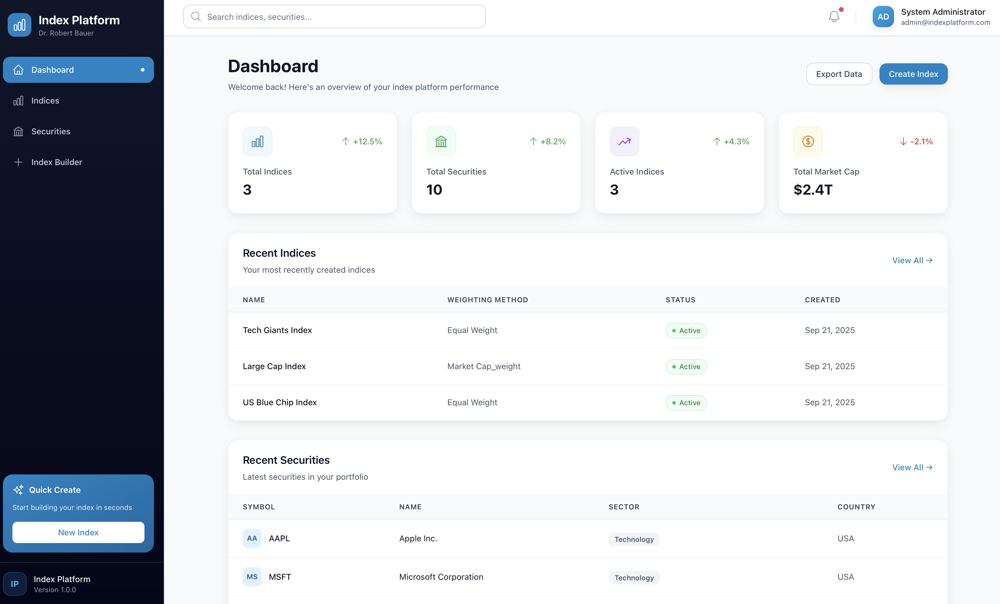

# Index Platform

> **Eine enterprise-grade Indexing-Plattform für Finanzmarktdaten**  
> Modulare Architektur für Datenaufnahme, -verarbeitung und Index-Berechnung mit modernem Web-Interface

[](https://python.org)
[](https://fastapi.tiangolo.com)
[](https://reactjs.org)
[](https://docker.com)
[](https://kubernetes.io)


*Dashboard für Index Management*

## 📋 Inhaltsverzeichnis

- [Überblick](#überblick)
- [Architektur](#architektur)
- [Technologie-Stack](#technologie-stack)
- [Schnellstart](#schnellstart)
- [Detaillierte Installation](#detaillierte-installation)
- [API-Dokumentation](#api-dokumentation)
- [Frontend-Guide](#frontend-guide)
- [Deployment](#deployment)
- [Entwicklung](#entwicklung)
- [Troubleshooting](#troubleshooting)
- [Contributing](#contributing)

## 🎯 Überblick

Die Index Platform ist eine vollständige Lösung für die Verwaltung und Berechnung von Finanzindizes. Sie ermöglicht es, Finanzmarktdaten zu erfassen, zu verarbeiten und Indizes nach verschiedenen Gewichtungsmethoden zu berechnen - ähnlich wie MSCI oder andere führende Index-Anbieter.

### Kernfunktionen

- **📊 Datenaufnahme**: Unterstützung für CSV, JSON und API-Datenquellen (Alpha Vantage, Yahoo Finance)
- **🔄 ETL/ELT Pipeline**: Automatische Datenbereinigung und -transformation
- **📈 Index-Berechnung**: Multiple Gewichtungsmethoden (Equal Weight, Market Cap, Price Weight, ESG)
- **🔐 Authentifizierung**: OAuth2/JWT-basierte Sicherheit
- **🌐 Moderne UI**: React-basiertes Dashboard mit interaktiven Charts
- **🐳 Containerisierung**: Docker + Kubernetes für skalierbare Deployment
- **📡 APIs**: REST + GraphQL Endpoints für maximale Flexibilität

## 🏗️ Architektur

### System-Architektur

```
┌─────────────────┐    ┌─────────────────┐    ┌─────────────────┐
│   Frontend      │    │   API Layer     │    │ Business Logic  │
│                 │    │                 │    │                 │
│ ┌─────────────┐ │    │ ┌─────────────┐ │    │ ┌─────────────┐ │
│ │ React UI    │ │◄──►│ │ REST API    │ │◄──►│ │ Index Engine│ │
│ │ Dashboard   │ │    │ │ GraphQL API │ │    │ │ ETL Pipeline│ │
│ │ Index Builder │    │ │ Auth        │ │    │ │ Calculation │ │
│ └─────────────┘ │    │ └─────────────┘ │    │ └─────────────┘ │
└─────────────────┘    └─────────────────┘    └─────────────────┘
         │                       │                       │
         │                       │                       │
         ▼                       ▼                       ▼
┌─────────────────┐    ┌─────────────────┐    ┌─────────────────┐
│   Data Layer    │    │ External APIs   │    │ File Storage    │
│                 │    │                 │    │                 │
│ ┌─────────────┐ │    │ ┌─────────────┐ │    │ ┌─────────────┐ │
│ │ PostgreSQL  │ │    │ │ Alpha Vantage │    │ │ CSV Files   │ │
│ │ Redis Cache │ │    │ │ Yahoo Finance │    │ │ JSON Data   │ │
│ │ File Storage│ │    │ │ Custom APIs   │    │ │ Reports     │ │
│ └─────────────┘ │    │ └─────────────┘ │    │ └─────────────┘ │
└─────────────────┘    └─────────────────┘    └─────────────────┘
```

### Datenfluss-Architektur

```
Raw Data Sources → Data Cleaner → Data Transformer → Quality Validator
       ↓              ↓              ↓                ↓
External APIs → Staging Tables → Analytics Tables → Index Tables
       ↓              ↓              ↓                ↓
CSV/JSON Files → Index Engine → Weighting Methods → Performance Metrics
       ↓              ↓              ↓                ↓
File Storage → REST Endpoints → GraphQL Schema → WebSocket Events
```

### Microservices-Architektur (Kubernetes)

```
┌────────────────────────────────────────────────────────────────┐
│                    Kubernetes Cluster                          │
│                                                                │
│ ┌─────────────┐  ┌─────────────┐  ┌─────────────┐              │
│ │ Frontend Pod│  │ Backend Pods│  │ Worker Pods │              │
│ │             │  │             │  │             │              │
│ │ React App   │  │ API Instance│  │ Celery      │              │
│ │ Nginx       │  │ API Instance│  │ Worker      │              │
│ │             │  │ API Instance│  │ Celery Beat │              │
│ └─────────────┘  └─────────────┘  └─────────────┘              │
│                                                                │
│ ┌─────────────┐  ┌─────────────┐  ┌─────────────┐              │
│ │ Data Pods   │  │ Ingress     │  │ External    │              │
│ │             │  │             │  │             │              │
│ │ PostgreSQL  │  │ NGINX       │  │ Users       │              │
│ │ Redis       │  │ Ingress     │  │ APIs        │              │
│ └─────────────┘  └─────────────┘  └─────────────┘              │
└────────────────────────────────────────────────────────────────┘
```

## 🛠️ Technologie-Stack

### Backend
- **Framework**: FastAPI 0.104+ (Python 3.11+)
- **Datenbank**: PostgreSQL 15+ mit SQLAlchemy ORM
- **Caching**: Redis 7+
- **Authentifizierung**: JWT mit OAuth2
- **Background Tasks**: Celery mit Redis
- **API**: REST + GraphQL (Graphene)
- **Data Processing**: Pandas, NumPy, Polars
- **Testing**: Pytest, FastAPI TestClient

### Frontend
- **Framework**: React 18+ mit TypeScript
- **Styling**: Tailwind CSS
- **State Management**: Zustand
- **Data Fetching**: TanStack Query (React Query)
- **Charts**: Recharts
- **Routing**: React Router v6
- **Forms**: React Hook Form

### DevOps & Deployment
- **Containerisierung**: Docker & Docker Compose
- **Orchestrierung**: Kubernetes
- **CI/CD**: GitHub Actions (konfigurierbar)
- **Monitoring**: Prometheus + Grafana (optional)
- **Logging**: Structured Logging mit Python logging
- **Reverse Proxy**: NGINX

### Datenbank-Schema

```
SECURITIES (Master Data)
├── id (PK)
├── symbol (UK)
├── name
├── exchange
├── currency
├── sector
├── industry
├── country
├── market_cap
└── is_active

PRICE_DATA (Historical Prices)
├── id (PK)
├── security_id (FK)
├── date
├── open_price
├── high_price
├── low_price
├── close_price
├── volume
├── adjusted_close
├── dividend
└── split_ratio

INDEX_DEFINITIONS (Index Rules)
├── id (PK)
├── name (UK)
├── description
├── weighting_method
├── rebalance_frequency
├── max_constituents
├── min_market_cap
├── max_market_cap
├── sectors (JSON)
├── countries (JSON)
├── esg_criteria (JSON)
└── is_active

INDEX_VALUES (Calculated Values)
├── id (PK)
├── index_definition_id (FK)
├── date
├── index_value
├── total_return
├── price_return
├── dividend_yield
├── volatility
└── sharpe_ratio

INDEX_CONSTITUENTS (Composition)
├── id (PK)
├── index_definition_id (FK)
├── security_id (FK)
├── date
├── weight
├── shares
├── market_cap
├── is_new_addition
└── is_removal
```

## 🚀 Schnellstart

### Voraussetzungen
- Docker & Docker Compose
- Node.js 18+ (für lokale Entwicklung)
- Python 3.11+ (für lokale Entwicklung)

### 1. Repository klonen
```bash
git clone <repository-url>
cd index-platform
```

### 2. Mit Docker starten (Empfohlen)
```bash
# Alle Services starten
docker-compose up -d

# Logs verfolgen
docker-compose logs -f
```

### 3. Zugriff auf die Anwendung
- **Frontend**: http://localhost:3000
- **Backend API**: http://localhost:8000
- **API Docs**: http://localhost:8000/docs
- **GraphQL**: http://localhost:8000/graphql

### 4. Standard-Login
- **Username**: `admin`
- **Password**: `admin123`

## 📦 Detaillierte Installation

### Lokale Entwicklung

#### Backend Setup
```bash
cd backend

# Virtual Environment erstellen
python -m venv venv
source venv/bin/activate  # Windows: venv\Scripts\activate

# Dependencies installieren
pip install -r requirements.txt

# Environment Variables setzen
cp .env.example .env
# .env Datei anpassen

# Datenbank migrieren
alembic upgrade head

# Server starten
uvicorn app.main:app --reload --host 0.0.0.0 --port 8000
```

#### Frontend Setup
```bash
cd frontend

# Dependencies installieren
npm install

# Environment Variables setzen
cp .env.example .env.local
# .env.local anpassen

# Development Server starten
npm start
```

#### Datenbank Setup
```bash
# PostgreSQL installieren (Ubuntu/Debian)
sudo apt-get install postgresql postgresql-contrib

# Datenbank erstellen
sudo -u postgres createdb index_platform
sudo -u postgres createuser index_user
sudo -u postgres psql -c "ALTER USER index_user PASSWORD 'index_password';"
sudo -u postgres psql -c "GRANT ALL PRIVILEGES ON DATABASE index_platform TO index_user;"

# Redis installieren
sudo apt-get install redis-server
sudo systemctl start redis-server
```

### Docker-basierte Installation

#### Mit Docker Compose
```bash
# Environment konfigurieren
cp .env.example .env
# .env anpassen

# Services starten
docker-compose up -d

# Status prüfen
docker-compose ps

# Logs anzeigen
docker-compose logs -f backend
```

#### Mit Kubernetes
```bash
# Kubernetes Cluster vorbereiten
kubectl cluster-info

# Namespace erstellen
kubectl apply -f k8s/namespace.yaml

# Datenbank deployen
kubectl apply -f k8s/postgres.yaml
kubectl apply -f k8s/redis.yaml

# Backend deployen
kubectl apply -f k8s/backend.yaml

# Frontend deployen
kubectl apply -f k8s/frontend.yaml

# Ingress konfigurieren
kubectl apply -f k8s/ingress.yaml

# Status prüfen
kubectl get pods -n index-platform
```

## 📚 API-Dokumentation

### REST API

Die REST API folgt OpenAPI 3.0 Standards und bietet vollständige Swagger-Dokumentation.

#### Authentifizierung
```http
POST /api/v1/auth/token
Content-Type: application/x-www-form-urlencoded

username=admin&password=admin123&grant_type=password
```

#### Wichtige Endpoints

**Securities Management**
```http
GET    /api/v1/securities              # Liste aller Securities
GET    /api/v1/securities/{id}         # Security Details
POST   /api/v1/securities              # Neue Security erstellen
PUT    /api/v1/securities/{id}         # Security aktualisieren
DELETE /api/v1/securities/{id}         # Security löschen
GET    /api/v1/securities/{id}/prices  # Preis-Daten
```

**Index Management**
```http
GET    /api/v1/indices                 # Liste aller Indizes
GET    /api/v1/indices/{id}            # Index Details
POST   /api/v1/indices                 # Neuen Index erstellen
PUT    /api/v1/indices/{id}            # Index aktualisieren
GET    /api/v1/indices/{id}/values     # Index-Werte
GET    /api/v1/indices/{id}/constituents # Index-Konstituenten
POST   /api/v1/indices/{id}/calculate  # Index berechnen
POST   /api/v1/indices/{id}/backtest   # Backtest durchführen
```

**Data Ingestion**
```http
POST   /api/v1/ingestion/csv/securities    # CSV Securities importieren
POST   /api/v1/ingestion/csv/prices        # CSV Preise importieren
POST   /api/v1/ingestion/api/alpha-vantage # Alpha Vantage Daten
POST   /api/v1/ingestion/api/yahoo-finance # Yahoo Finance Daten
```

### GraphQL API

GraphQL bietet flexible Datenabfragen mit einem einzigen Endpoint.

#### Beispiel-Queries

**Securities abfragen**
```graphql
query GetSecurities {
  securities {
    edges {
      node {
        id
        symbol
        name
        sector
        marketCap
      }
    }
  }
}
```

**Index-Werte abfragen**
```graphql
query GetIndexValues($indexId: Int!) {
  index(id: $indexId) {
    name
    indexValues {
      date
      indexValue
      totalReturn
    }
  }
}
```

**Neuen Index erstellen**
```graphql
mutation CreateIndex($input: CreateIndexDefinitionInput!) {
  createIndexDefinition(input: $input) {
    indexDefinition {
      id
      name
      weightingMethod
    }
  }
}
```

## 🎨 Frontend-Guide

### Komponenten-Architektur

```
Pages/
├── Dashboard/           # Hauptübersicht
├── Indices/            # Index-Verwaltung
├── Securities/         # Securities-Verwaltung
├── IndexBuilder/       # Custom Index Builder
└── Login/              # Authentifizierung

Components/
├── Layout/             # Hauptlayout
├── Header/             # Navigation
├── Sidebar/            # Seitenmenü
├── Charts/             # Performance-Charts
├── Tables/             # Datentabellen
└── Forms/              # Eingabeformulare

Services/
├── API Client/         # HTTP-Client
├── Auth Context/       # Authentifizierung
└── React Query/        # Server-State

Utils/
├── Helpers/            # Hilfsfunktionen
├── Constants/          # Konstanten
└── TypeScript Types/   # Typdefinitionen
```

### Routing
```typescript
// Hauptrouten
/                    # Dashboard
/indices            # Index-Übersicht
/indices/:id        # Index-Details
/securities         # Securities-Übersicht
/builder            # Custom Index Builder
/login              # Login
/profile            # Benutzer-Profil
```

### State Management

Die Anwendung verwendet **Zustand** für globalen State und **TanStack Query** für Server-State.

```typescript
// Auth Store (Zustand)
interface AuthStore {
  user: User | null;
  token: string | null;
  login: (username: string, password: string) => Promise<void>;
  logout: () => void;
  isAuthenticated: boolean;
}

// API Queries (TanStack Query)
const { data: indices } = useQuery({
  queryKey: ['indices'],
  queryFn: () => api.indices.list(),
  staleTime: 5 * 60 * 1000, // 5 Minuten
});
```

### Custom Index Builder Workflow

```
Step 1: Basic Info → Step 2: Filters → Step 3: Time Range → Step 4: Backtest
   ↓                    ↓                   ↓                ↓
Name, Description    Sectors, Countries   Start/End Date   Run Calculation
Weighting Method     Market Cap Range     Time Range       View Results
                     Max Constituents     Configuration    Save/Export
```

## 🚢 Deployment

### Docker Deployment

#### Production Docker Compose
```yaml
version: '3.8'
services:
  backend:
    image: index-platform-backend:latest
    environment:
      - DATABASE_URL=postgresql://user:pass@db:5432/index_platform
      - REDIS_URL=redis://redis:6379/0
      - SECRET_KEY=your-production-secret-key
    depends_on:
      - db
      - redis
    deploy:
      replicas: 3
      resources:
        limits:
          memory: 512M
          cpus: '0.5'
```

#### Multi-Stage Build (Backend)
```dockerfile
# Build stage
FROM python:3.11-slim as builder
WORKDIR /app
COPY requirements.txt .
RUN pip install --user -r requirements.txt

# Production stage
FROM python:3.11-slim
WORKDIR /app
COPY --from=builder /root/.local /root/.local
COPY . .
USER appuser
CMD ["uvicorn", "app.main:app", "--host", "0.0.0.0", "--port", "8000"]
```

### Kubernetes Deployment

#### Production Values
```yaml
# values.yaml
replicaCount: 3
image:
  repository: index-platform-backend
  tag: latest
  pullPolicy: IfNotPresent

resources:
  limits:
    cpu: 500m
    memory: 512Mi
  requests:
    cpu: 250m
    memory: 256Mi

autoscaling:
  enabled: true
  minReplicas: 3
  maxReplicas: 10
  targetCPUUtilizationPercentage: 70

ingress:
  enabled: true
  className: "nginx"
  annotations:
    cert-manager.io/cluster-issuer: "letsencrypt-prod"
  hosts:
    - host: api.yourdomain.com
      paths:
        - path: /
          pathType: Prefix
  tls:
    - secretName: api-tls
      hosts:
        - api.yourdomain.com
```

#### Health Checks
```yaml
livenessProbe:
  httpGet:
    path: /health
    port: 8000
  initialDelaySeconds: 30
  periodSeconds: 10
  timeoutSeconds: 5
  failureThreshold: 3

readinessProbe:
  httpGet:
    path: /ready
    port: 8000
  initialDelaySeconds: 5
  periodSeconds: 5
  timeoutSeconds: 3
  failureThreshold: 3
```

### CI/CD Pipeline

#### GitHub Actions Workflow
```yaml
name: Deploy to Production

on:
  push:
    branches: [main]

jobs:
  test:
    runs-on: ubuntu-latest
    steps:
      - uses: actions/checkout@v3
      - name: Run Tests
        run: |
          cd backend
          pip install -r requirements.txt
          pytest tests/
  
  build:
    needs: test
    runs-on: ubuntu-latest
    steps:
      - uses: actions/checkout@v3
      - name: Build Images
        run: |
          docker build -t ${{ secrets.REGISTRY }}/backend:${{ github.sha }} ./backend
          docker build -t ${{ secrets.REGISTRY }}/frontend:${{ github.sha }} ./frontend
      - name: Push Images
        run: |
          docker push ${{ secrets.REGISTRY }}/backend:${{ github.sha }}
          docker push ${{ secrets.REGISTRY }}/frontend:${{ github.sha }}
  
  deploy:
    needs: build
    runs-on: ubuntu-latest
    steps:
      - name: Deploy to K8s
        run: |
          kubectl set image deployment/backend backend=${{ secrets.REGISTRY }}/backend:${{ github.sha }}
          kubectl set image deployment/frontend frontend=${{ secrets.REGISTRY }}/frontend:${{ github.sha }}
```

## 👨‍💻 Entwicklung

### Code-Struktur

```
backend/
├── app/
│   ├── api/                    # API Layer
│   │   ├── api_v1/
│   │   │   ├── endpoints/      # REST Endpoints
│   │   │   └── deps.py         # Dependencies
│   │   └── graphql/            # GraphQL Schema
│   ├── auth/                   # Authentication
│   ├── calculation/            # Index Calculation Engine
│   ├── core/                   # Core Configuration
│   ├── db/                     # Database Models & Schemas
│   ├── ingestion/              # Data Ingestion
│   ├── processing/             # ETL/ELT Pipeline
│   └── main.py                 # Application Entry Point
├── tests/                      # Test Suite
├── alembic/                    # Database Migrations
└── requirements.txt            # Python Dependencies

frontend/
├── src/
│   ├── components/             # Reusable Components
│   ├── pages/                  # Page Components
│   ├── services/               # API Services
│   ├── contexts/               # React Contexts
│   ├── utils/                  # Utility Functions
│   └── types/                  # TypeScript Types
├── public/                     # Static Assets
└── package.json                # Node Dependencies
```

### Entwicklungsworkflow

```
main branch
├── feature/new-index-type
│   ├── Add ESG weighting
│   └── Add tests
├── hotfix/security-fix
│   └── Fix JWT validation
└── release/v1.1
    └── Release notes
```

### Testing

#### Backend Tests
```bash
cd backend

# Unit Tests
pytest tests/unit/

# Integration Tests
pytest tests/integration/

# API Tests
pytest tests/api/

# Coverage Report
pytest --cov=app tests/
```

#### Frontend Tests
```bash
cd frontend

# Unit Tests
npm test

# E2E Tests
npm run test:e2e

# Coverage Report
npm run test:coverage
```

### Code Quality

#### Backend
- **Linting**: Black, isort, flake8
- **Type Checking**: mypy
- **Security**: bandit
- **Dependencies**: safety

```bash
# Code formatting
black app/
isort app/

# Linting
flake8 app/
mypy app/
bandit -r app/
```

#### Frontend
- **Linting**: ESLint, Prettier
- **Type Checking**: TypeScript
- **Testing**: Jest, React Testing Library

```bash
# Code formatting
npm run format

# Linting
npm run lint

# Type checking
npm run type-check
```

## 🔧 Troubleshooting

### Häufige Probleme

#### Backend startet nicht
```bash
# Logs prüfen
docker-compose logs backend

# Datenbank-Verbindung testen
docker-compose exec backend python -c "
from app.core.database import engine
print('DB connected:', engine.execute('SELECT 1').scalar())
"
```

#### Frontend kann API nicht erreichen
```bash
# CORS-Einstellungen prüfen
curl -H "Origin: http://localhost:3000" \
     -H "Access-Control-Request-Method: GET" \
     -H "Access-Control-Request-Headers: X-Requested-With" \
     -X OPTIONS \
     http://localhost:8000/api/v1/securities
```

#### Datenbank-Migrationen
```bash
# Neue Migration erstellen
cd backend
alembic revision --autogenerate -m "Description"

# Migration ausführen
alembic upgrade head

# Migration zurücksetzen
alembic downgrade -1
```

#### Kubernetes Debugging
```bash
# Pod-Logs anzeigen
kubectl logs -f deployment/backend -n index-platform

# Pod-Status prüfen
kubectl describe pod <pod-name> -n index-platform

# Service-Endpoints prüfen
kubectl get endpoints -n index-platform

# Ingress-Status prüfen
kubectl describe ingress index-platform-ingress -n index-platform
```

### Performance-Optimierung

#### Datenbank
```sql
-- Indizes für häufige Queries
CREATE INDEX idx_price_data_security_date ON price_data(security_id, date);
CREATE INDEX idx_index_values_index_date ON index_values(index_definition_id, date);

-- Partitionierung für große Tabellen
CREATE TABLE price_data_2024 PARTITION OF price_data
FOR VALUES FROM ('2024-01-01') TO ('2025-01-01');
```

#### API-Caching
```python
# Redis-Caching für teure Berechnungen
@cache(expire=3600)  # 1 Stunde
def calculate_index_performance(index_id: int):
    # Expensive calculation
    pass
```

#### Frontend-Optimierung
```typescript
// React.memo für teure Komponenten
const ExpensiveChart = React.memo(({ data }) => {
  // Chart rendering
});

// Virtualisierung für große Listen
import { FixedSizeList as List } from 'react-window';
```

## 🤝 Contributing

### Beitragen zur Entwicklung

1. **Fork** das Repository
2. **Feature Branch** erstellen (`git checkout -b feature/amazing-feature`)
3. **Änderungen committen** (`git commit -m 'Add amazing feature'`)
4. **Branch pushen** (`git push origin feature/amazing-feature`)
5. **Pull Request** erstellen

### Code-Standards

- **Python**: PEP 8, Black formatting
- **TypeScript**: ESLint + Prettier
- **Commits**: Conventional Commits
- **Tests**: >90% Coverage erforderlich
- **Dokumentation**: Alle öffentlichen APIs dokumentieren

### Issue-Template

```markdown
## Bug Report / Feature Request

### Beschreibung
Kurze Beschreibung des Problems oder Features

### Schritte zur Reproduktion (für Bugs)
1. 
2. 
3. 

### Erwartetes Verhalten
Was sollte passieren?

### Aktuelles Verhalten
Was passiert tatsächlich?

### Environment
- OS: 
- Python Version:
- Node Version:
- Docker Version:
```

---

## 📞 Support & Kontakt

- **Dokumentation**: [Wiki](https://github.com/your-org/index-platform/wiki)
- **Issues**: [GitHub Issues](https://github.com/your-org/index-platform/issues)
- **Discussions**: [GitHub Discussions](https://github.com/your-org/index-platform/discussions)
- **Email**: support@indexplatform.com

## 📄 Lizenz

Dieses Projekt steht unter der MIT-Lizenz. Siehe [LICENSE](LICENSE) für Details.

---

**Entwickelt mit ❤️ für die Finanz-Community**
